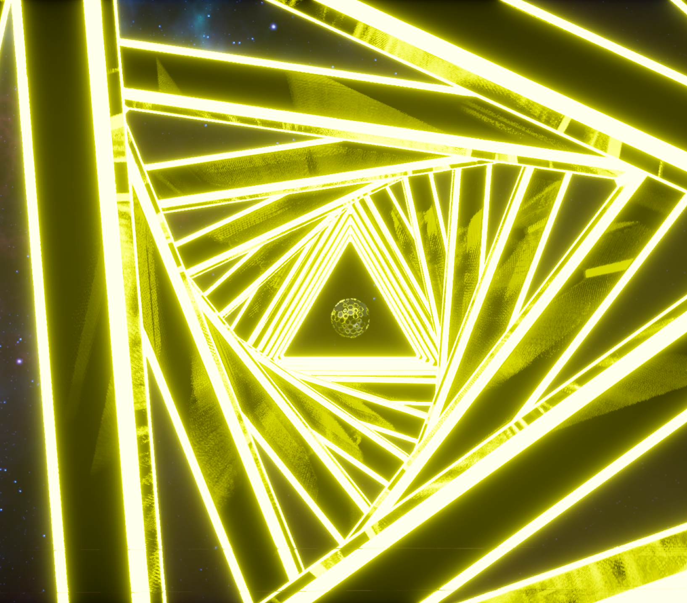
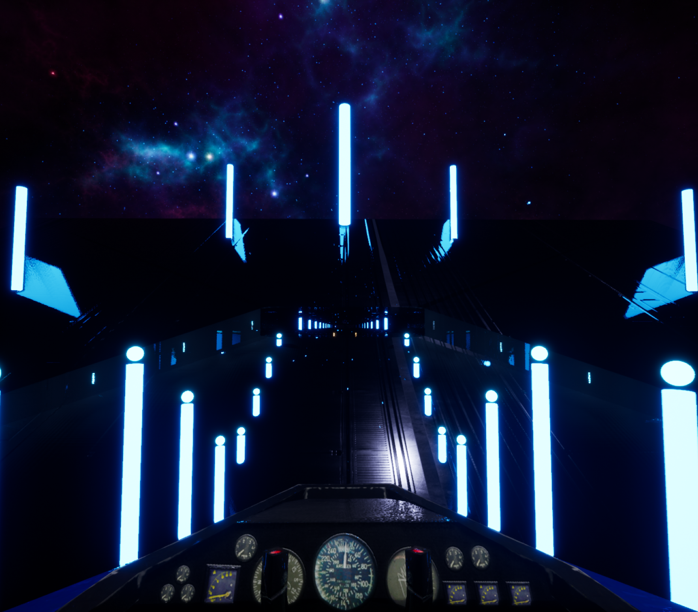

Get Set Go is a Visual-Musical VR Experience

[Please visit the demo reel at appility.co](https://www.youtube.com/watch?v=FzIip0bBdRQ)

Get Set Go is built with Unreal Engine 4 and is based upon an electronic music production of mine. Events are synchronized with the various sections of the song through the use of Sequencer, blueprint interfaces, collision volumes, etc.

-   Material Parameters - Unreal Engine's Material system is used to drive various effects, ranging from pulsing lights, fade effects, patterns, etc.

-   Real Time Interpolating - As a player goes through the level, real time interpolation is triggered by collision volumes and sequencer/music synchronization. Interpolating materials parameters enables the use of appealing visual impact such as triggering lights to flash upon a certain section of the song.

-   Unreal Engine Blueprints are used to direct the sequence of operations that occur as the player goes through the level, although C++ is used at times at low level implementations.

